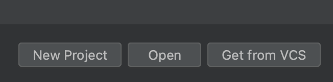
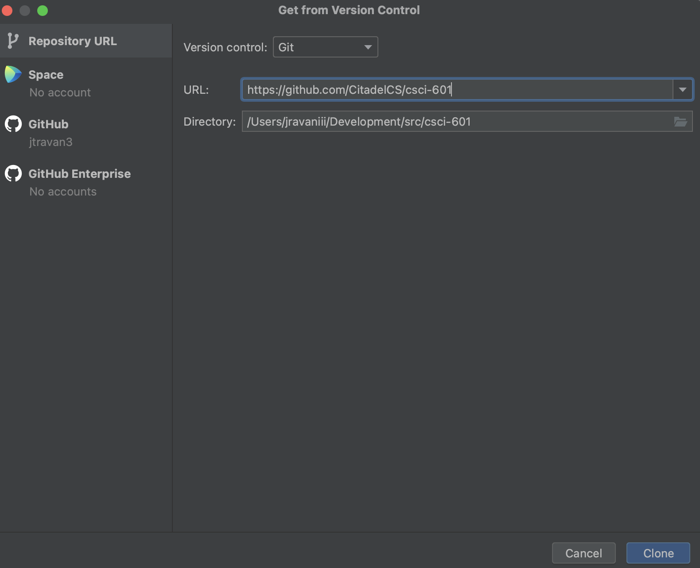
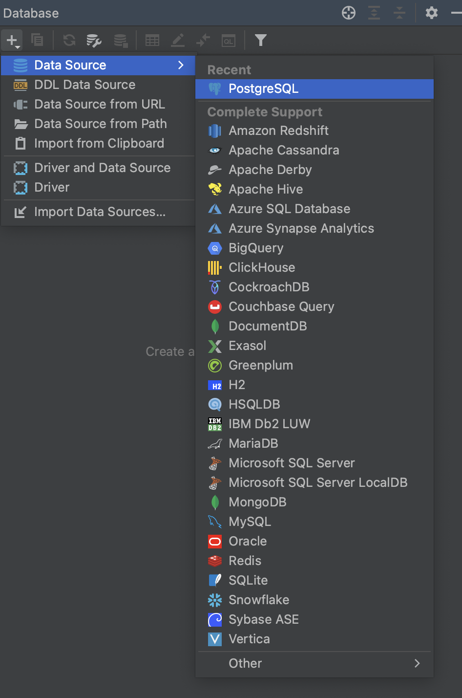
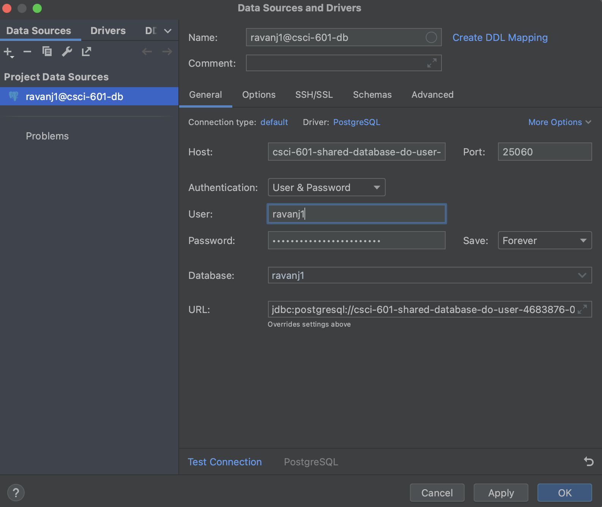
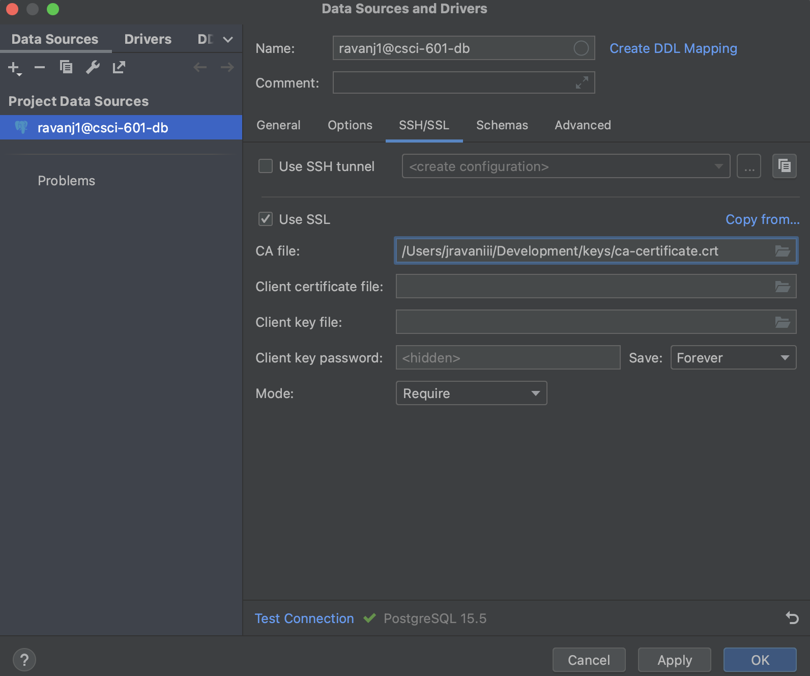
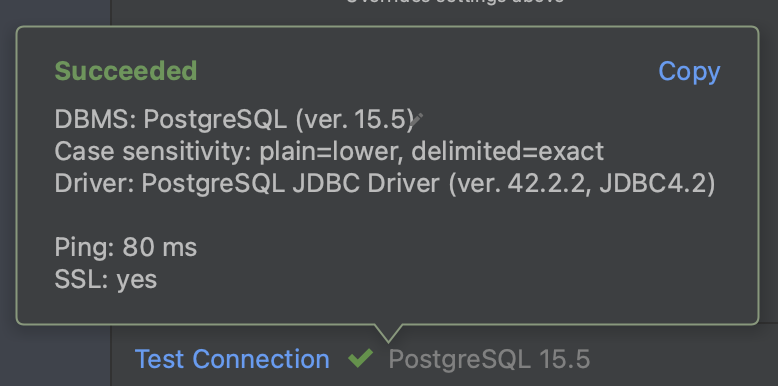
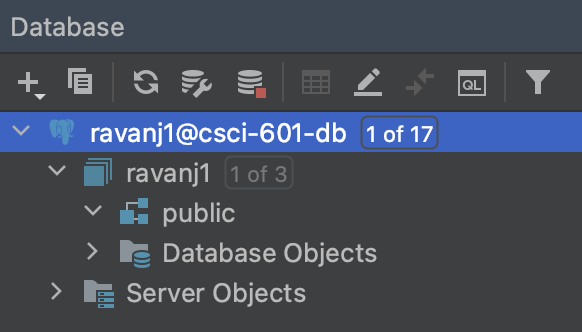
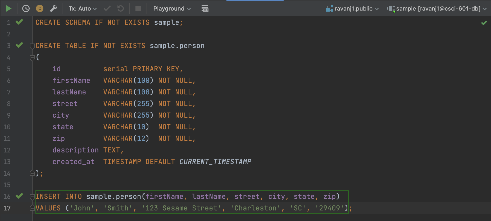
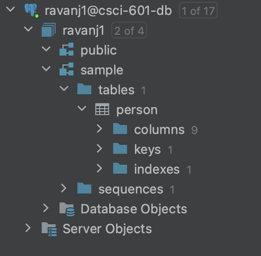

# CSCI 601 Data Modeling

[](https://opensource.org/licenses/MIT)
[](http://makeapullrequest.com)

## Environment Setup

> [!NOTE]  
> Java is not needed for this and is an optional step

1.) Install Java JDK 17+. JDK located [here](https://openjdk.java.net/install/). If you have a Mac you can use `brew`.

```bash
brew install java
```

2.) Create your personal repository from Github. You should receive a unique link from your professor from Github Classroom that will generate a private repository within your Github account.
It should look something like this.

```bash
https://classroom.github.com/a/{classroomId}
```

This will create your personal repository within the [Citadel CS Github Organization](https://github.com/CitadelCS).

3.) Open IntelliJ and select `Get from VCS`



4.) Copy the URL of your newly created personal repo and paste it into the text box. Click `Clone` and this will copy the
code from Github to your local machine and create a new IntelliJ project for you.



5.) On the right hand side of IntelliJ select the Datasource tab. Create a Datasource in IntelliJ in order to connect to the database by selecting `Postgres`



6.) Input the connection information sent to you from your professor



7.) Link the CA Certificate file to your credentials



8.) Test your connection and you should see a successful message



9.) Click `Apply` and you now have a datasource that you can connect to and run queries on.



10.) Then open the directory labeled `sample` and run the `sample.sql` script.



11.) After running you should see a new schema with a table called `person` created.



12.) Success! You now have a connection to a cloud managed Postgres DB that you can run queries.